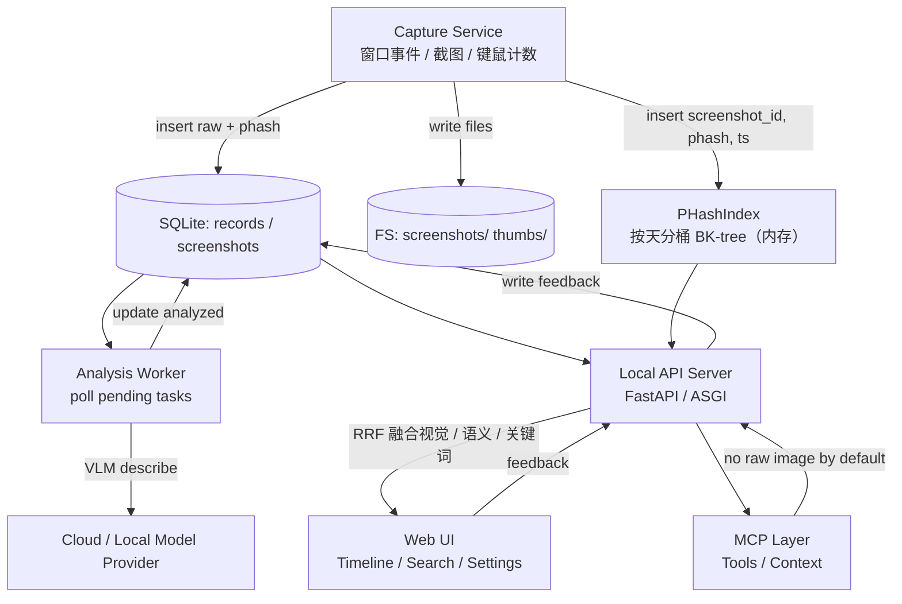

# 架构总览

> 返回 [Wiki 首页](../readme.md)

---

## **⚠️ 本页描述 v1 单进程架构，与 P1 之后的现状不一致**

主要变更：
- 代码已按 `src/timetrace/{common,client,server}/` 三层重组
- 运行时**两种入口**并存：单进程 `uv run timetrace`（默认稳定）+ 双进程 `timetrace-server` + `timetrace-client`（P3a-5b 接线完成）
- 通信层：双进程模式走 HTTP multipart + Bearer token + Outbox（at-least-once，crash-safe）
- 鉴权：`ServerAuth` token 体系；浏览器 admin UI 短期不做（CLI over SSH 足够）

**当前事实**：
- 完整重构路线 + 当前阶段状态：[`devlogs/infra/archive-202605151200-client-server-split-kickoff.md`](../../devlogs/infra/archive-202605151200-client-server-split-kickoff.md)
- 项目协作约定速读：[`CLAUDE.md`](../../CLAUDE.md)
- 用户向使用流程：[`README.md`](../../README.md)

整页重写计划在所有 P0–P7 完成后整体翻新（架构图、组件交互、运行时拓扑均需重画）。

---

## 分层原则

| 层 | 原则 |
|----|------|
| **采集层（Capture）** | 极轻：不做模型推理、不做重计算；只做"采集 → 落盘 → 落库 → 标记 pending" |
| **分析层（Worker）** | 异步：可控并发、可重试、可降级；通过 SQLite 状态字段驱动，无需引入 Redis |
| **API 层** | 统一业务逻辑：Web UI 与 MCP 复用同一服务层，避免两套逻辑分叉 |
| **存储层** | 本地优先：SQLite 单文件 + 文件系统，serverless / zero-config，可分发 |

---

## 端到端数据流



---

## 进程 / 线程建议

| 进程 | 职责 |
|------|------|
| `timetrace_capture` | 采集、托盘图标、轻量日志 |
| `timetrace_worker` | 分析工作器（可与 capture 同进程不同线程；稳定后再拆） |
| `timetrace_api` | 本地 API（供 UI 与 MCP 复用） |
| `timetrace_ui` | 静态前端文件（由 API server 提供或单独静态服务） |

> **当前实现**：TaskGroup 已搬到 `src/timetrace/server/bootstrap.py::serve`，固定起 5 个任务（worker / api / quit_watcher / reclaim / report_scheduler，其中 `report_scheduler` 是 P0 新增的 AI 看板定时生成）。`main.py` 与 `server/cli.py` 共享 `serve()`；单进程模式由 `main.py` 把 capture 经 `extra_tasks={"capture": ...}` 注入同一 TaskGroup。

```python
# server/bootstrap.py::serve
async with asyncio.TaskGroup() as tg:
    tg.create_task(components.worker.run(), name="worker")
    tg.create_task(server.serve(),          name="api")
    tg.create_task(_watch_quit(),           name="quit_watcher")
    tg.create_task(_reclaim_loop(),         name="reclaim")
    tg.create_task(_report_scheduler(),     name="report_scheduler")
    for name, coro in (extra_tasks or {}).items():
        tg.create_task(coro, name=name)     # main.py 注入 capture

# main.py 注入 capture（单进程模式）：
await serve(components, config, quit_event, extra_tasks={"capture": capture_svc.run()})
```

**退出流程**（Ctrl+C 与托盘退出共用同一路径）：

```
SIGINT / 托盘"退出"
  → signal.signal(SIGINT) handler 或 tray on_quit()
  → loop.call_soon_threadsafe(quit_event.set)
  → _watch_quit() 唤醒
      → server.should_exit = True       # uvicorn 通过轮询退出
      → cancel(capture / worker / reclaim)
  → TaskGroup 等待所有任务结束
  → db.close()
  → main.shutdown_complete
```

Ctrl+C 通过 `signal.signal(signal.SIGINT, ...)` 拦截，路由到与托盘退出相同的 `quit_event` 路径，避免 uvicorn `capture_signals` 在 finally 中二次抛出信号打断清理流程。

**线程模型**：

| 线程 | daemon | 职责 |
|------|--------|------|
| 主线程 | — | asyncio 事件循环 |
| tray | True | pystray 消息泵 |
| idle-listen | True | 启动 pynput 监听器后立即返回 |
| pynput kb/ms listener | True | 键鼠事件 Windows hook 消息泵 |
| idle-stop | True | 关闭 pynput 监听器（短暂） |
| screenshot executor | False | `run_in_executor` 截图（短暂，< 1s） |

daemon=True 的线程在进程退出时被 OS 自动终止，不阻塞退出。

---

## 模块职责速览

> ⚠️ 路径已 P1 三层重组（commit `8aa6e2f`）：旧 `src/timetrace/{capture,worker,rules,storage,api,mcp_layer,phash_index}/` 顶层目录已不存在，统一迁入 `client/` `server/` `common/` 三层。下表已更新为现行路径；权威清单见 [`CLAUDE.md`](../../CLAUDE.md)。

| 模块 | 文件 | 核心职责 |
|------|------|---------|
| Capture Service | `src/timetrace/client/capture/service.py` | 监听窗口切换、触发截图、写 records / screenshots（含 phash），同步 PHashIndex |
| Privacy Guard | `src/timetrace/client/capture/privacy.py` | 黑名单过滤、暂停判断 |
| Analysis Worker | `src/timetrace/server/worker/loop.py` | 状态机驱动 VLM 流程 |
| Rule Engine | `src/timetrace/server/rules/engine.py` | 规则匹配 + VLM 出 category 的加权投票（`decide_category`），分类收紧为 flat 6 类；KNN 已删 |
| Database | `src/timetrace/server/db/sqlite.py`（别名 `server/db/__init__.py` 导出 `Database`） | aiosqlite 封装、Schema 初始化与迁移 |
| PHash Index | `src/timetrace/server/phash_index/` | pHash 计算（`common/phash_hash.py`）、BK-tree（`bk_tree.py`）、按天分桶索引（`index.py`） |
| API Factory | `src/timetrace/server/api/app.py` | FastAPI 应用工厂（注入 db / phash_index / thumbs 静态挂载） |
| Search Route | `src/timetrace/server/api/routes/search.py` | `/v1/search/by-image` 多通道检索 + RRF 融合 |
| MCP Layer | `src/timetrace/server/mcp_layer/server.py` | `build_mcp_server`（FastMCP，注册 6 个 tool：search_activity / get_recent_activity / get_app_breakdown / get_category_stats / apply_label / ask_agent），挂 `/mcp/`、bearer 守门。旧 `server/mcp_layer/tools.py` 是已废弃 stub，不再使用 |
| Config | `src/timetrace/common/config.py` + `src/timetrace/client/core/config.py` | Dataclass 配置，带合理默认值 |

---

## 相关文档

- [Capture Service](capture-service.md)
- [Analysis Worker](analysis-worker.md)
- [Rule/Feedback Engine](rule-engine.md)
- [Local API Server](api-server.md)
- [MCP Layer](mcp-layer.md)
- [存储策略](../storage/overview.md)
